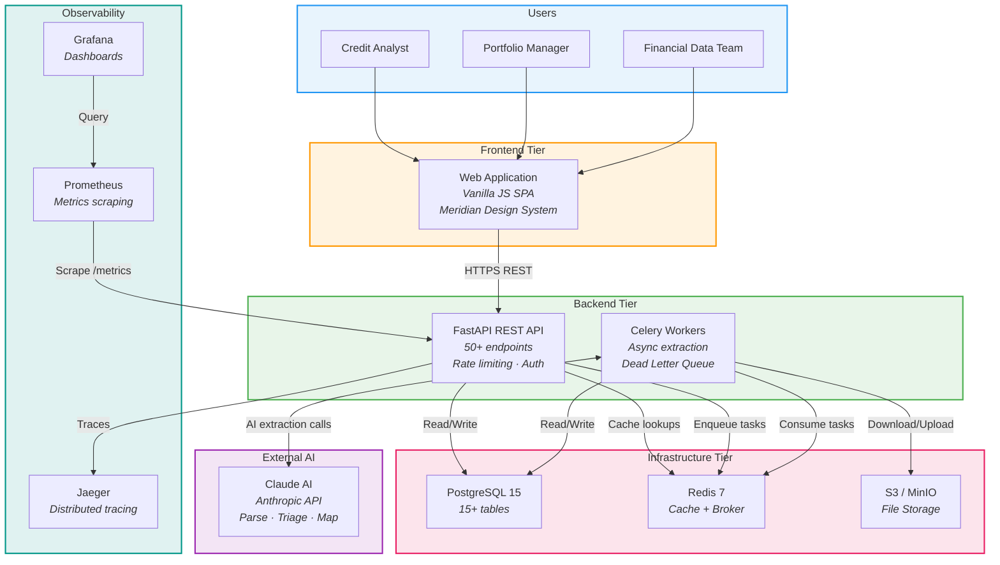
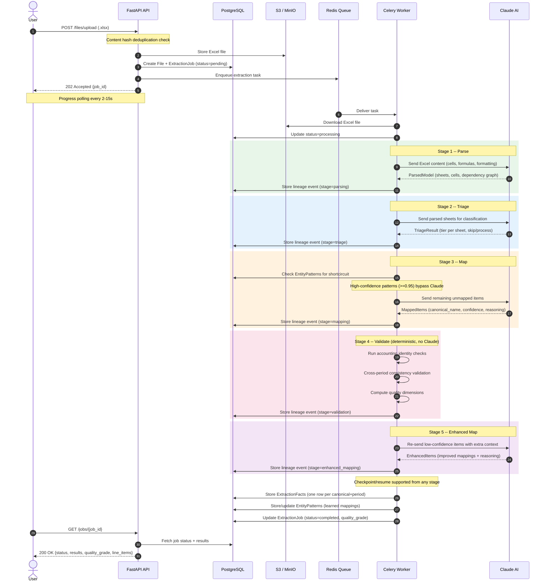
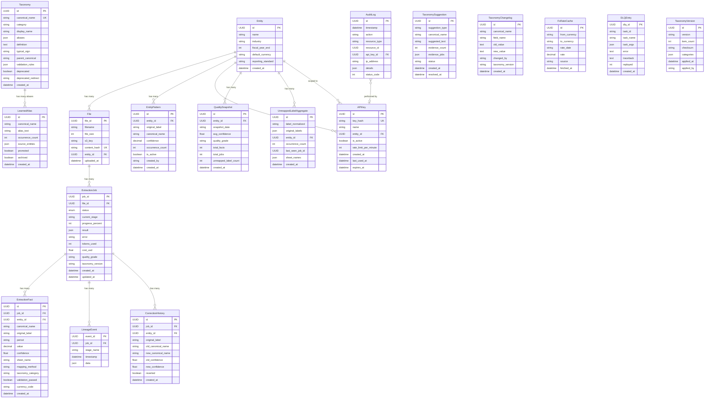
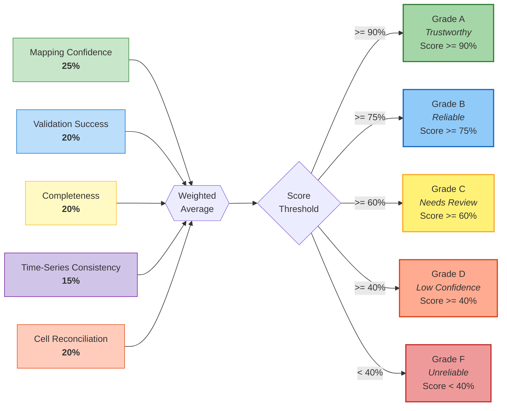
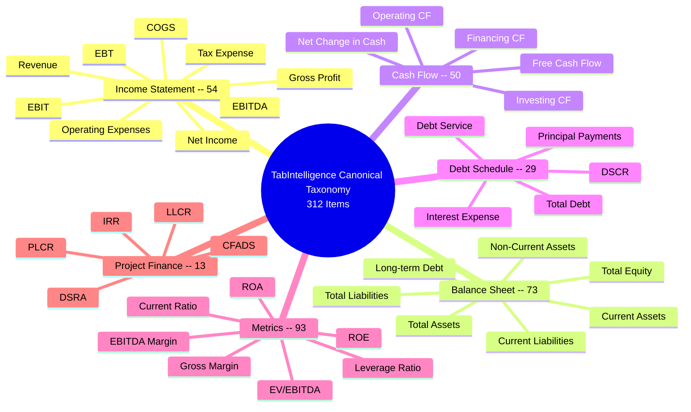

# TabIntelligence -- System Architecture

This document provides a comprehensive visual overview of the TabIntelligence Excel Model Intelligence Platform. The diagrams below cover the full system topology, extraction pipeline lifecycle, database schema, quality scoring methodology, and canonical taxonomy hierarchy. Together they serve as the authoritative architecture reference for engineering, product, and stakeholder audiences.

---

## 1. System Architecture

The platform follows a four-tier architecture with asynchronous extraction workers, an external AI integration layer, and a full observability stack. Users interact through a lightweight SPA frontend; all heavy computation is offloaded to Celery workers that orchestrate multi-stage Claude AI calls.

---

## 2. Extraction Pipeline

The extraction lifecycle is a five-stage pipeline mixing Claude AI calls with deterministic validation. The pipeline supports checkpoint/resume from any stage, content-hash deduplication, and progress polling for the frontend.

---

## 3. Database Entity Relationship Diagram

The database schema comprises 17 tables covering entities, taxonomy governance, extraction results, audit compliance, and operational concerns (DLQ, FX cache, quality snapshots). Relationships enforce referential integrity with cascading deletes where appropriate.

---

## 4. Quality Scoring System

Each extraction job receives a composite quality grade derived from five weighted dimensions. The weighted average maps to a letter grade that communicates trustworthiness to credit analysts at a glance.

---

## 5. Taxonomy Hierarchy

The canonical taxonomy contains 312 standardized financial line items organized into six top-level categories. Each category covers a specific domain of financial analysis, from traditional income statement items through specialized project finance metrics.

---

*Document generated for the TabIntelligence Excel Model Intelligence Platform documentation package.*
