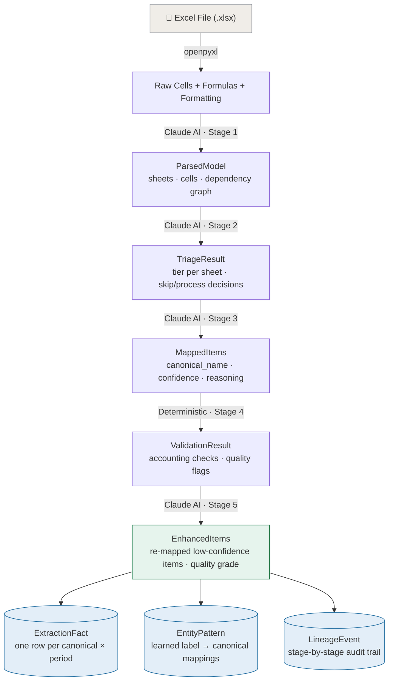
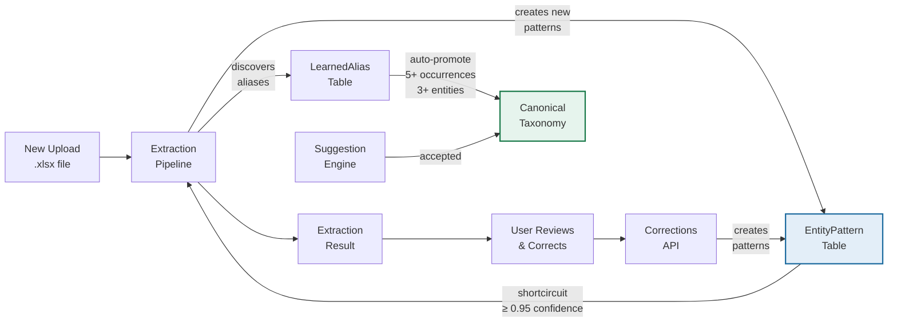
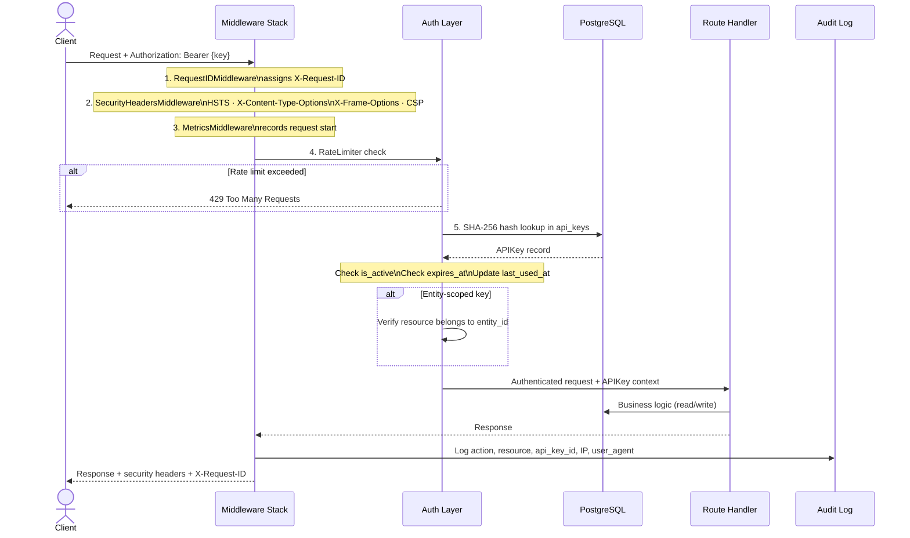
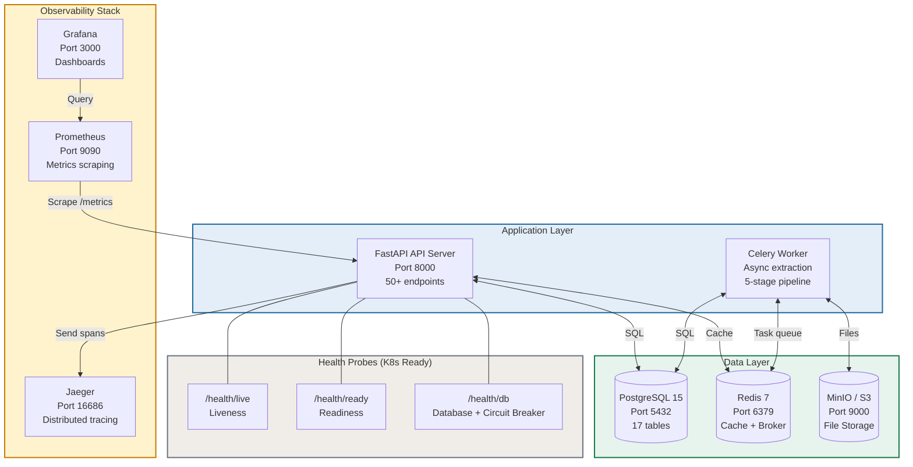

# DebtFund — Data Flow & Integration Diagrams

> Detailed data transformation, learning loop, security, and deployment diagrams for the DebtFund platform.

---

## 1. Complete Data Lifecycle

Every Excel file goes through a deterministic transformation chain. Each stage produces typed output that feeds the next.

---

## 2. Entity Learning Feedback Loop

The platform gets smarter with every extraction. Entity patterns create a compounding data asset that reduces Claude API calls and improves accuracy over time.

**Compounding improvement:**

| Extraction # | Pattern Cache | Shortcircuit Rate | Claude API Calls |
|:---:|:---:|:---:|:---:|
| 1st | Empty | 0% | 100% of labels |
| 3rd | ~40 patterns | ~40% | 60% of labels |
| 10th | ~120 patterns | ~70% | 30% of labels |
| 20th+ | ~200 patterns | ~85% | 15% of labels |

---

## 3. Security & Authentication Flow

Every request goes through five middleware layers before reaching the route handler. All significant actions are audit-logged.

---

## 4. Deployment Architecture

Full Docker Compose topology with Kubernetes-ready health probes.

**Docker Compose services:**

| Service | Image | Ports | Purpose |
|---------|-------|-------|---------|
| `api` | debtfund:api | 8000 | FastAPI REST server + static frontend |
| `worker` | debtfund:worker | — | Celery async extraction |
| `postgres` | postgres:15 | 5432 | Primary database |
| `redis` | redis:7 | 6379 | Cache + message broker |
| `minio` | minio/minio | 9000, 9001 | S3-compatible file storage |
| `prometheus` | prom/prometheus | 9090 | Metrics collection |
| `grafana` | grafana/grafana | 3000 | Monitoring dashboards |
| `jaeger` | jaegertracing/all-in-one | 16686 | Distributed tracing UI |

---

*Document generated for the DebtFund Excel Model Intelligence Platform documentation package.*
