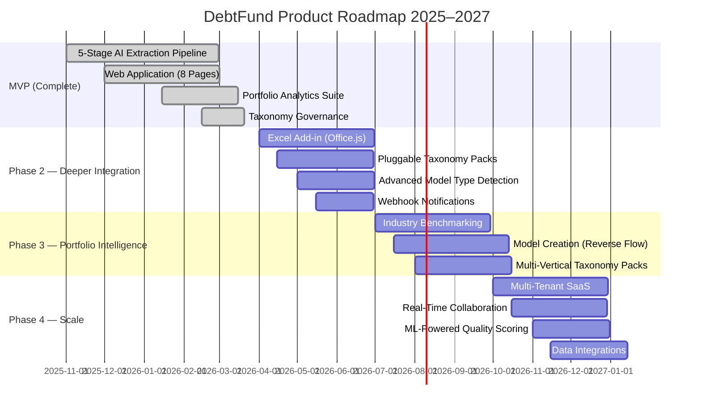

# DebtFund — Product Roadmap

> Vision and planned development phases for the DebtFund Excel Model Intelligence Platform.

---

## Timeline

---

## MVP — Complete (March 2026)

The foundational platform is built, tested, and operational.

### What's been delivered

**Core Extraction**
- 5-stage AI extraction pipeline (Parse → Triage → Map → Validate → Enhanced Map)
- 312-item canonical financial taxonomy with hierarchical structure
- Entity-specific pattern learning with confidence decay
- Checkpoint/resume from any pipeline stage
- Content-hash deduplication

**Web Application (8 pages)**
- Dashboard with portfolio KPIs and quick upload
- Extractions list with real-time progress tracking
- Job Detail with 5 tabs (Line Items, Triage, Validation, Lineage, Corrections)
- Entity management with pattern library and financials
- Taxonomy browser with hierarchy, search, suggestions, changelog
- Analytics suite with 6 intelligence modules
- System admin with health monitoring and DLQ management

**Portfolio Analytics**
- Cross-entity comparison with FX normalization
- Anomaly detection (IQR and Z-score methods)
- Quality trending per entity over time
- Confidence calibration analytics
- Unmapped label gap analysis
- Cost analytics by entity and day

**Taxonomy Governance**
- AI-generated improvement suggestions
- Deprecation workflow with redirects
- Field-level changelog with version tracking
- Learned alias lifecycle with auto-promotion

**Infrastructure**
- 50+ REST API endpoints with OpenAPI documentation
- API key auth with entity scoping and rate limiting
- Comprehensive audit logging
- Docker deployment with full observability stack
- CI/CD pipeline with 2,555+ automated tests
- Kubernetes-ready health probes

### Key metrics

| Metric | Target | Status |
|--------|--------|--------|
| Extraction accuracy (Tier 1) | >85% | On track |
| Lineage completeness | 100% | Achieved |
| Human review rate | <20% | On track |
| Time to extract (first model) | <15 min | Achieved |
| Cost per model | <$0.75 | Achieved |

---

## Phase 2 — Deeper Integration (Q2–Q3 2026)

Bringing DebtFund closer to the analyst's existing workflow.

### Excel Add-in (Office.js)
Extract data directly from within Excel — no need to leave the spreadsheet. The add-in will:
- Show a sidebar panel inside Excel with extraction controls
- Highlight extracted cells with color-coded confidence indicators
- Allow inline corrections that sync back to the platform
- Support both desktop and web versions of Excel

### Pluggable Taxonomy Packs
Support for industry-specific taxonomies beyond corporate finance:
- **Real Estate**: NOI, cap rate, occupancy, rental income, GLA
- **Infrastructure**: CFADS, DSRA, LLCR, construction costs, concession terms
- **Healthcare**: patient revenue, reimbursement rates, bed days
- Taxonomy packs installable per entity or globally

### Advanced Model Type Detection
Automatic detection of model type with type-specific extraction strategies:
- Corporate (LBO, operating model)
- Project Finance (single asset, concession)
- Real Estate (property-level, portfolio)
- Construction-only (no operating period)
- Each type uses optimized quality scoring weights

### Webhook Notifications
Push-based notifications for key events:
- Extraction completed (with quality grade)
- Quality grade dropped below threshold
- Anomaly detected in portfolio
- New taxonomy suggestion generated
- Configurable per entity and event type

---

## Phase 3 — Portfolio Intelligence (Q3–Q4 2026)

Turning extracted data into actionable portfolio insights.

### Industry Benchmarking
Compare entity metrics against anonymized peer data:
- "Is this company's EBITDA margin in the top quartile for its industry?"
- Percentile ranking across 20+ standard metrics
- Peer group selection by industry, revenue band, geography
- Anonymized — no individual entity data exposed

### Model Creation (Reverse Flow)
Generate standardized Excel financial models from structured data:
- Same canonical taxonomy, reverse direction
- Template-based output with consistent formatting
- Pre-populated with extracted data
- Useful for standardizing sponsor models into house format

### Multi-Vertical Taxonomy Packs
Pre-built taxonomy packs for specific verticals:
- Real estate (property-level metrics, NOI bridges)
- Infrastructure (project finance ratios, construction milestones)
- Healthcare (patient economics, capacity metrics)
- Energy (production volumes, hedging, reserves)
- Each pack includes aliases, validation rules, and quality scoring weights

---

## Phase 4 — Scale (Q4 2026 – Q1 2027)

Enterprise features for larger teams and organizations.

### Multi-Tenant SaaS
Full multi-tenancy for managed service delivery:
- Organization-level data isolation
- User roles and permissions (admin, analyst, viewer)
- Organization-level API keys and rate limits
- Usage billing and cost allocation

### Real-Time Collaboration
Multiple analysts working on the same extraction:
- Live cursors showing who's reviewing which items
- Real-time correction sync across sessions
- Conflict resolution for simultaneous edits
- Comment threads on specific line items

### ML-Powered Quality Scoring
Replace heuristic quality scorer with a trained ML model:
- Calibrated confidence predictions based on historical accuracy
- Model trained on correction history (actual vs. predicted)
- Expected calibration error (ECE) < 0.05
- Continuous retraining as correction corpus grows

### Data Integrations
Connect to external financial data providers:
- **Bloomberg Terminal**: Market data overlay for extracted financials
- **S&P Capital IQ**: Industry benchmarks and peer comparisons
- **Refinitiv**: Reference data for entity matching
- Import/export connectors for common data warehouse platforms

---

*Document generated for the DebtFund Excel Model Intelligence Platform documentation package.*
